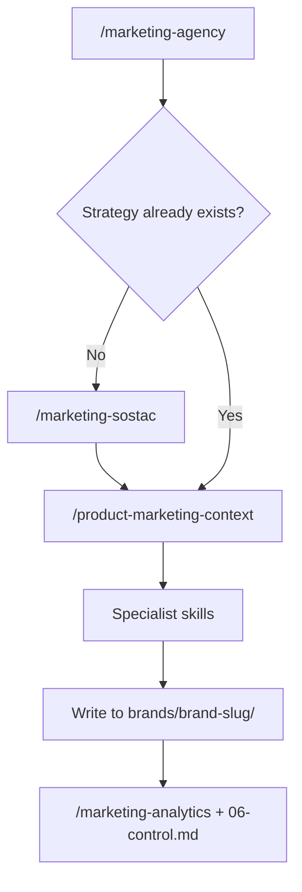

# Agentic Marketing Docs

Use this docs set to understand how the suite works, where to start, what each skill produces, and how outputs move through the brand workspace.

## Start here

- [Getting started](getting-started.md)
- [New brand onboarding](workflows/new-brand-onboarding.md)
- [SOSTAC planning](workflows/sostac-planning.md)
- [Implementation after SOSTAC](workflows/implementation-after-sostac.md)
- [Quick task without a full plan](workflows/quick-task-without-full-plan.md)

## Core concepts

- [Brand workspace](reference/brand-workspace.md)
- [Common patterns](reference/common-patterns.md)
- [Deliverables and file locations](reference/deliverables-and-file-locations.md)
- [Glossary](reference/glossary.md)

## Skill reference

### Coordinator and planning
- [marketing-agency](skills/marketing-agency.md)
- [marketing-sostac](skills/marketing-sostac.md)
- [product-marketing-context](skills/product-marketing-context.md)

### Channel execution
- [marketing-content](skills/marketing-content.md)
- [marketing-email](skills/marketing-email.md)
- [marketing-seo](skills/marketing-seo.md)
- [marketing-social](skills/marketing-social.md)
- [marketing-video](skills/marketing-video.md)
- [marketing-paid-ads](skills/marketing-paid-ads.md)
- [marketing-pr](skills/marketing-pr.md)
- [marketing-influencer](skills/marketing-influencer.md)
- [marketing-referral](skills/marketing-referral.md)
- [marketing-community](skills/marketing-community.md)
- [marketing-guerrilla](skills/marketing-guerrilla.md)

### Conversion and revenue
- [marketing-cro](skills/marketing-cro.md)
- [marketing-retention](skills/marketing-retention.md)
- [marketing-pricing](skills/marketing-pricing.md)
- [marketing-launch](skills/marketing-launch.md)
- [marketing-sales](skills/marketing-sales.md)
- [marketing-psychology](skills/marketing-psychology.md)

### Measurement
- [marketing-analytics](skills/marketing-analytics.md)

## How the suite usually flows

## Recommended ways to use the suite

### 1. Full strategic build
Start with `/marketing-agency` or `/marketing-sostac` when you want a durable, cross-channel plan.

### 2. Execution from an existing plan
If a brand already has SOSTAC files, create or refresh `product-marketing-context.md` and then run the specialist skills tied to the tactics.

### 3. One-off deliverable
If you only need one asset right now, start with a specialist directly. The suite may still suggest strategy if context is thin.

## Design principle

Most skills are not just prompt generators. They are file-producing workflows. The outputs are meant to accumulate inside `brands/{brand-slug}/` so future sessions can resume from real artifacts instead of memory.

Skills use **progressive disclosure** — each SKILL.md stays lean while hundreds of framework files are available on demand. A lightweight `frameworks-index.csv` in each skill lets Claude match your situation to the right framework file without loading everything into context.
